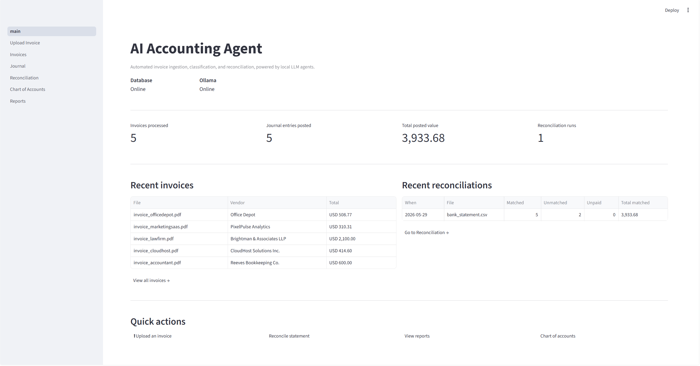
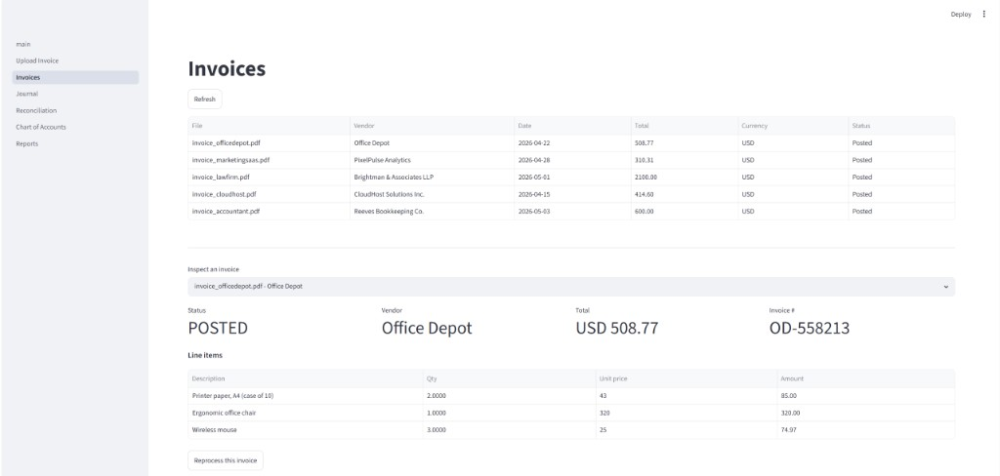
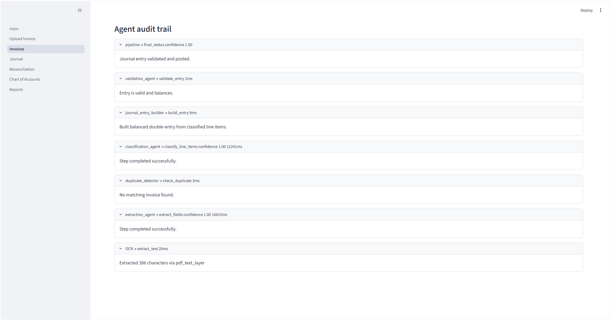
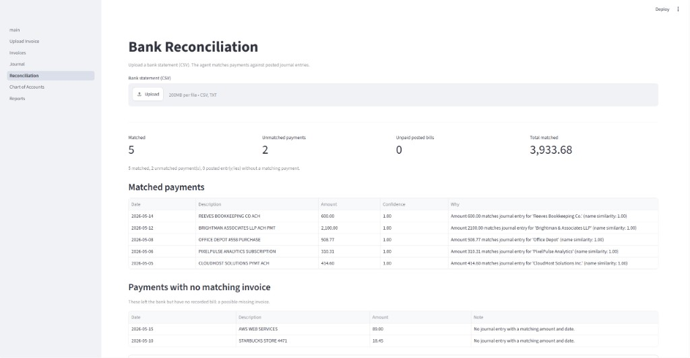
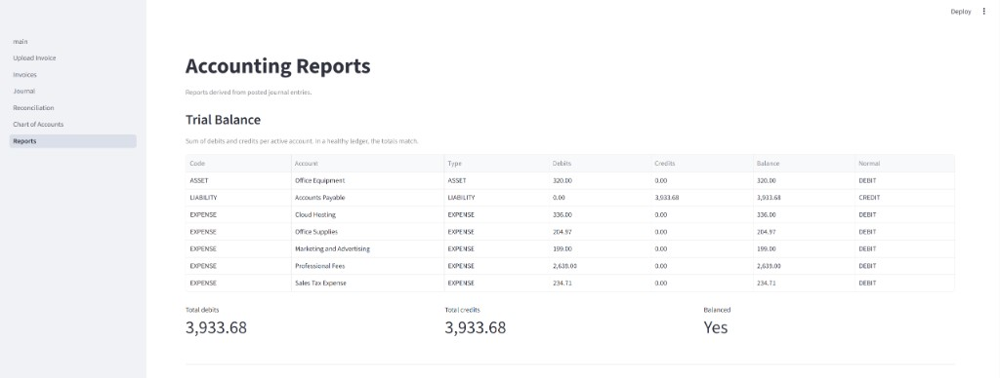
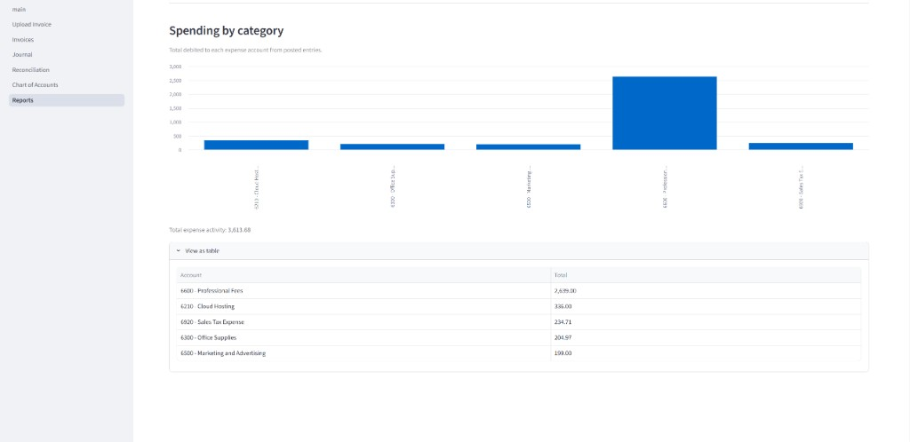

# AI Accounting Agent

An AI-powered accounting automation system that ingests invoices, extracts structured data, classifies them into proper double-entry journal entries, and reconciles them against bank statements — using a multi-agent architecture powered by local LLMs (Ollama) or cloud LLMs (Groq).

**Live demo:** [https://ai-accounting-agent-1.streamlit.app/](https://ai-accounting-agent-1.streamlit.app/)

Sign up with any email/password to try the full flow (upload → review → journal → reconciliation)

## Problem & motivation

Small business owners and finance teams spend a disproportionate amount of their week on rote bookkeeping: keying invoice data into accounting software, mapping each line to the right GL account, and reconciling bank statements line-by-line. The work is mostly judgment-light pattern recognition that LLMs and structured pipelines are well-suited to automate end-to-end.

This project is an end-to-end demonstration: drop a PDF in, and the system OCRs it, extracts the structured fields, classifies each line to a GL account, builds a balanced double-entry journal entry, validates it, and posts it — with a full audit trail of every decision. Upload a bank CSV and it matches payments back to those entries (and records the payment journal entry when a bill is paid).

### Design philosophy: LLM for judgment, code for arithmetic

A core design call worth highlighting: **the LLM is used only for judgment tasks** (extracting fields from messy OCR text, picking a GL account for each line item). All arithmetic — building the double-entry, computing totals, balancing debits against credits, validating the entry, matching bank transactions — is deterministic Python. LLMs are unreliable at arithmetic, and the rules of double-entry bookkeeping are inviolable. Keeping the money math out of the model means the books stay correct, fast, and auditable.

### UI surfaces

| Page | What it does |
|---|---|
| **Login / Signup** | JWT auth; sessions persist across reloads via browser localStorage |
| **Home / Dashboard** | KPI cards, system status, recent invoices and reconciliation runs, quick actions |
| **Upload Invoice** | Drop a PDF or image; polls for status with a stepwise progress bar (OCR → extract → dedupe → classify → build → validate) and shows the final extracted fields |
| **Invoices** | Filterable list with status badges and per-status count strip; full detail with line items, journal entry, and the agent audit trail; reprocess / reclassify buttons |
| **Journal** | All journal entries with status filter, balanced/unbalanced markers, one-click CSV export |
| **Reconciliation** | Upload a new statement or open any past run; three result tables (matched / unmatched payments / unpaid bills) plus a CSV export; matched bills get a payment journal entry |
| **Chart of Accounts** | Filterable GL account list with per-type counts |
| **Reports** | Trial balance (debits, credits, balance per account) and a spending-by-category bar chart |
| **Review** | Manual override for invoices marked `NEEDS_REVIEW` (low confidence, missing vendor, unbalanced entry, or fallback account); picks GL accounts and re-runs the same builder/validator |

## Screenshots

### Overview

The home dashboard shows system health, key metrics, and recent activity at a glance.



### Invoice processing

Browse posted invoices, inspect line items, and drill into the full agent audit trail for any upload.





### Bank reconciliation

Upload a bank CSV and see matched payments, unmatched transactions, and the reasoning behind each match.



### Reports

Trial balance and spending-by-category views are built from posted journal entries.





## Architecture

```
Bank statement CSV
       │
       ▼
┌────────────────────┐   transactions   ┌──────────────────────────┐
│ Bank statement     │ ───────────────▶ │  Reconciliation agent     │
│ parser             │                  │  (deterministic matching) │
│ (signed / debit-   │                  │  amount + date + fuzzy    │
│  credit / typed)   │                  │  vendor-name similarity   │
└────────────────────┘                  └──────────────────────────┘
                                                     │
                          ┌──────────────────────────┼──────────────────────────┐
                          ▼                           ▼                          ▼
                     MATCHED                    UNMATCHED payment          UNMATCHED journal entry
                  (bill was paid;            (possible missing invoice)   (posted bill, possibly unpaid)
                   payment JE posted)
```

Auth and tenancy sit around the pipeline: when `JWT_SECRET` is set, every API route (except health/signup/login) requires a Bearer token, and invoices, journal entries, agent logs, and reconciliation runs are scoped to the authenticated user.

## Prerequisites

- Docker + Docker Compose
- Ollama installed on host machine (https://ollama.com) — for local LLM mode
- ~6 GB free disk space for the LLM model (local only)
- Optional: a Groq API key for cloud LLM mode / Streamlit Cloud deployment

## Setup

### 1. Install Ollama and pull a model (local LLM)

```bash
# Install Ollama from https://ollama.com (one-line install on Linux/Mac)
# Then pull a model:
ollama pull llama3.1:8b

# Verify it's running:
curl http://localhost:11434/api/tags
```

Skip this step if you set `LLM_PROVIDER=groq` and provide `GROQ_API_KEY`.

### 2. Clone the repo and configure environment

```bash
git clone https://github.com/YOUR_USERNAME/ai-accounting-agent.git
cd ai-accounting-agent
cp .env.example .env
```

Useful env vars (see `.env.example` and `backend/app/config.py`):

| Variable | Purpose |
|---|---|
| `LLM_PROVIDER` | `ollama` (default) or `groq` |
| `OLLAMA_URL` / `OLLAMA_MODEL` | Local LLM endpoint and model |
| `GROQ_API_KEY` / `GROQ_MODEL` | Cloud LLM (used when `LLM_PROVIDER=groq`) |
| `JWT_SECRET` | Enables signup/login and per-user data isolation; leave empty for open local single-user mode |
| `DATABASE_URL` | Optional; overrides Postgres settings for hosted DBs (Neon, Render, etc.) |

### 3. Start the stack

```bash
docker compose up --build
```

This will:
- Start PostgreSQL
- Build and start the FastAPI backend
- Build and start the Streamlit frontend
- The backend automatically runs migrations and seeds the chart of accounts on startup

### 4. Verify everything works

- Backend health check: http://localhost:8000/health
- API docs (Swagger): http://localhost:8000/docs
- Frontend: http://localhost:8501

The frontend page should show a green "Backend OK" status. If `JWT_SECRET` is set, sign up or log in before using the app.

## API endpoints

| Method | Path | Purpose |
|---|---|---|
| GET | `/health` | DB + LLM (Ollama or Groq) status |
| POST | `/auth/signup` | Create account; returns JWT |
| POST | `/auth/login` | Log in; returns JWT |
| GET | `/auth/me` | Current user email |
| GET | `/chart-of-accounts` | List GL accounts |
| POST | `/invoices/upload` | Upload an invoice (PDF/image); processing starts in background |
| GET | `/invoices` | List invoices (optional `?status=` filter; user-scoped when auth is on) |
| GET | `/invoices/{id}` | Invoice detail with line items |
| GET | `/invoices/{id}/logs` | Full agent audit trail for an invoice |
| POST | `/invoices/{id}/reprocess` | Re-run the full pipeline on an invoice |
| GET | `/invoices/{id}/journal-entry` | The bill journal entry generated for an invoice |
| GET | `/invoices/{id}/payment-entry` | Payment journal entry (after reconciliation match), if any |
| POST | `/invoices/{id}/reclassify` | Re-run only classification + validation |
| GET | `/invoices/{id}/review` | Review detail for a `NEEDS_REVIEW` invoice |
| POST | `/invoices/{id}/review` | Submit GL overrides and post via the same builder/validator |
| GET | `/journal-entries` | List all journal entries |
| GET | `/journal-entries/{id}` | Journal entry detail with debit/credit lines |
| POST | `/reconciliation/upload` | Upload a bank CSV; returns the reconciliation report |
| GET | `/reconciliation/runs` | List past reconciliation runs |
| GET | `/reconciliation/runs/{id}` | Full report for a reconciliation run |
| GET | `/journal-entries/export` | Download all journal entries as CSV |
| GET | `/reconciliation/runs/{id}/export` | Download a reconciliation report as CSV |
| GET | `/dashboard/summary` | KPIs + recent activity for the home page |
| GET | `/reports/trial-balance` | Trial balance from posted entries |
| GET | `/reports/expense-breakdown` | Total spend per expense account |

When `JWT_SECRET` is set, protected routes expect `Authorization: Bearer <token>`.

## Trying it out

1. Make sure Ollama is running with the model pulled: `ollama pull llama3.1:8b` (or configure Groq)
2. `docker compose up --build`
3. Generate sample invoices (one-time): `python samples/generate_samples.py`
4. Open the frontend at http://localhost:8501 (sign up if auth is enabled) → **Upload Invoice** → drop in `samples/invoice_cloudhost.pdf`
5. Watch it process, then view the extracted fields and agent audit trail on the **Invoices** page
6. If an invoice lands in `NEEDS_REVIEW`, open the **Review** page to assign GL accounts and post it
7. Upload the same file again to see duplicate detection in action

Or via the API:

```bash
curl -F "file=@samples/invoice_cloudhost.pdf" http://localhost:8000/invoices/upload
# → {"invoice_id": "...", "status": "PENDING", ...}
curl http://localhost:8000/invoices/<invoice_id>
```

With auth enabled, add `-H "Authorization: Bearer <token>"` after signup/login.

## Database Schema

| Table | Purpose |
|---|---|
| `users` | Accounts (email + password hash) for JWT auth |
| `chart_of_accounts` | GL account list (Assets, Liabilities, Revenue, etc.) |
| `invoices` | Uploaded invoice metadata + status (user-scoped) |
| `invoice_line_items` | Extracted line items per invoice |
| `journal_entries` | Double-entry records (`BILL` or `PAYMENT`) |
| `journal_entry_lines` | Individual debit/credit lines |
| `agent_logs` | Audit trail of every agent (and human reviewer) decision |
| `reconciliation_runs` | Past bank reconciliation runs |
| `bank_transactions` | Normalized rows from uploaded statements |

## Project Structure

```
ai-accounting-agent/
├── docker-compose.yml
├── .env.example
├── docs/
│   └── screenshots/                # UI screenshots for the README
├── samples/                        # sample invoice PDFs + generator
│   ├── generate_samples.py
│   └── invoice_*.pdf
├── backend/
│   ├── Dockerfile                  # includes tesseract-ocr + poppler
│   ├── requirements.txt
│   ├── alembic.ini
│   ├── migrations/
│   └── app/
│       ├── main.py                 # FastAPI entrypoint
│       ├── config.py               # Settings (env vars)
│       ├── database.py             # SQLAlchemy session
│       ├── security.py             # JWT middleware + current-user helpers
│       ├── models/                 # ORM models (incl. User)
│       ├── schemas/                # Pydantic request/response models
│       ├── seed/                   # Chart of accounts seed data
│       ├── agents/
│       │   ├── extraction_agent.py     # LLM: extract fields from text
│       │   ├── classification_agent.py # LLM: map line items to GL accounts
│       │   ├── validation_agent.py     # deterministic double-entry validation
│       │   └── reconciliation_agent.py # deterministic bank matching
│       ├── services/
│       │   ├── ocr.py                  # PDF/image → text
│       │   ├── llm_factory.py          # Ollama vs Groq selector
│       │   ├── ollama_client.py        # local LLM client
│       │   ├── groq_client.py          # cloud LLM client
│       │   ├── auth_service.py         # signup / login / JWT
│       │   ├── duplicate_detection.py
│       │   ├── journal_entry_builder.py# deterministic double-entry construction
│       │   ├── bank_statement_parser.py# CSV → normalized transactions
│       │   ├── reconciliation_processor.py  # match + post payment JEs
│       │   ├── review_service.py       # human override → rebuild & validate
│       │   ├── agent_logger.py         # audit-trail helper
│       │   └── invoice_processor.py    # pipeline orchestrator
│       └── api/                        # health, auth, chart_of_accounts, invoices,
│                                       #   journal_entries, reconciliation,
│                                       #   dashboard, reports
└── frontend/
    ├── Dockerfile
    ├── requirements.txt
    ├── main.py                         # home dashboard
    ├── auth.py                         # login/signup, Bearer helpers, localStorage session
    ├── ui_helpers.py                   # shared badges + formatting
    └── pages/
        ├── 1_Upload_Invoice.py
        ├── 2_Invoices.py               # detail + journal entry + audit trail
        ├── 3_Journal.py                # all entries with status filter + CSV
        ├── 4_Reconciliation.py         # upload + past runs + CSV
        ├── 5_Chart_of_Accounts.py
        ├── 6_Reports.py                # trial balance + spending chart
        └── 7_Review.py                 # manual review for NEEDS_REVIEW invoices
```

## Useful commands

```bash
# Tail logs
docker compose logs -f backend

# Open a Postgres shell
docker compose exec postgres psql -U accounting -d accounting_db

# Run migrations manually
docker compose exec backend alembic upgrade head

# Create a new migration after changing models
docker compose exec backend alembic revision --autogenerate -m "your message"

# Stop everything
docker compose down

# Reset everything (including the database)
docker compose down -v
```

## Testing

The backend has ~200 tests covering agents, pipelines, auth, user isolation, review, schema, and the HTTP layer.

```bash
# Inside the backend container (or with backend deps installed locally):
cd backend
pip install -r requirements-dev.txt
alembic upgrade head
python -m app.seed.run_seed
pytest tests/                                 # full suite
pytest tests/ --cov=app --cov-report=term     # with coverage
pytest tests/unit/                            # just the no-DB unit tests
pytest tests/ -k duplicate -v                 # name-filter tests
```

| Layer | Tests | Covers |
|---|---|---|
| `tests/unit/` | extraction normalization/truncation, reconciliation matching, bank statement parser, OCR preprocessing | Pure functions; no DB or LLM |
| `tests/integration/` | journal entry builder, validation agent, duplicate detection, invoice processor, reconciliation + payment recording, review workflow, user data isolation | Real Postgres; LLM mocked |
| `tests/api/` | health, auth, invoices, reconciliation, dashboard, reports, CSV exports | FastAPI TestClient |

CI runs on every push and pull request via `.github/workflows/ci.yml`: spins up a Postgres service, installs Tesseract and Poppler, runs migrations, seeds the chart of accounts, and executes the full test suite.

## Deployment

**Public demo:** [https://ai-accounting-agent-1.streamlit.app/](https://ai-accounting-agent-1.streamlit.app/)

The live app uses Streamlit Community Cloud for the UI, a hosted Postgres database, and Groq as the LLM provider (`LLM_PROVIDER=groq`). JWT auth is enabled so each visitor gets an isolated workspace.

For local development:

- **Ollama on the host** is the default (`LLM_PROVIDER=ollama`). Swap to Groq with `LLM_PROVIDER=groq` and a `GROQ_API_KEY`.
- **Auth is optional locally.** Set `JWT_SECRET` to require signup/login and enforce per-user scoping; leave it empty for an open single-user sandbox.
- **Docker Compose** remains the primary local path: healthchecks on Postgres, migrations on backend startup, Streamlit frontend standalone. Pointing the same stack at managed Postgres and deploying behind a reverse proxy is straightforward.

For evaluators: clone the repo, install Ollama and `llama3.1:8b` (or configure Groq), run `docker compose up --build`, and the system is live at http://localhost:8501 in about two minutes — or open the [hosted demo](https://ai-accounting-agent-1.streamlit.app/) with no setup.

## Limitations & future work

Things deliberately not solved in this scope, in rough priority order if it were a real product:

- **Cash-vs-credit at invoice time.** Invoices still post as bills (credit Accounts Payable). Payment journal entries are created when bank reconciliation matches a payment to a bill. Inferring “paid on the spot” from the invoice itself (cash/card) is still future work.
- **Sales tax treatment.** Tax is treated as a non-recoverable expense (correct for most US sales tax on business purchases, wrong for VAT-recoverable jurisdictions). A real product would need jurisdiction-aware tax handling.
- **Reconciliation uses fuzzy strings.** When amount + date give multiple candidates and names are genuinely ambiguous, an LLM disambiguation step (called only on the tied cases — a few per statement, not hundreds) would help.
- **Vision-only invoices.** Currently uses Tesseract OCR + a text LLM. Modern vision-language models (e.g. `llama3.2-vision`) could read invoice PDFs directly and likely do better on complex layouts.
- **Confidence thresholds are constants.** Production-grade: tune them per vendor or per account type based on historical accuracy.
- **Roles and admin tooling.** Auth and per-user isolation are in place; org-level roles, shared books, and admin dashboards are not.
